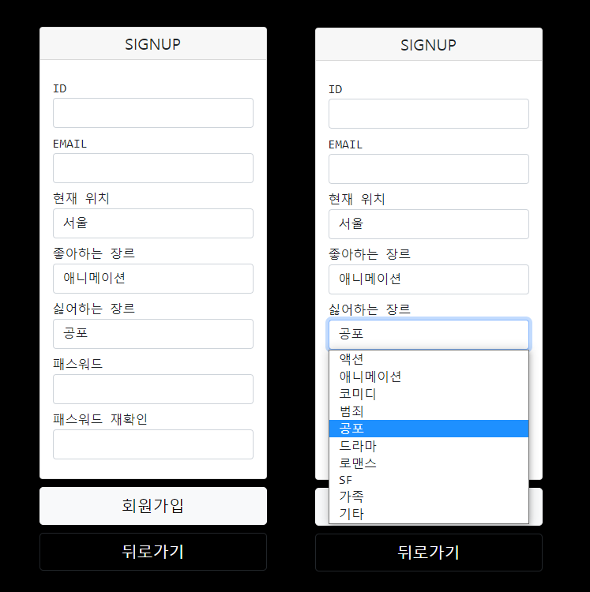
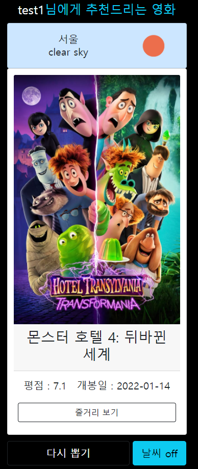
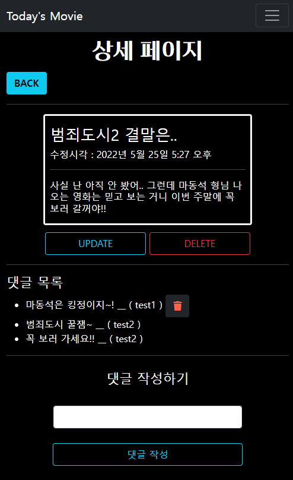
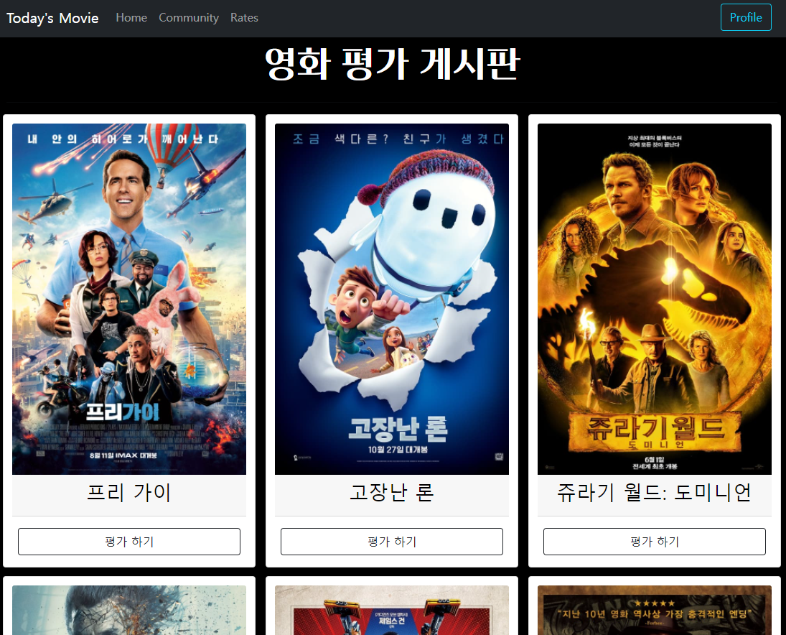
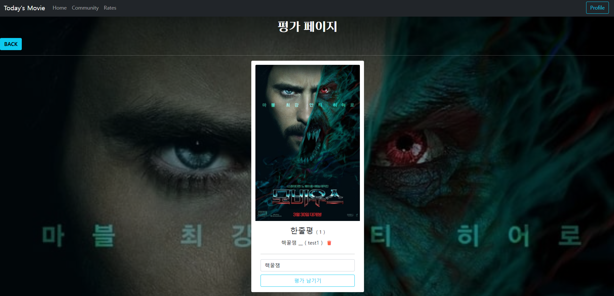
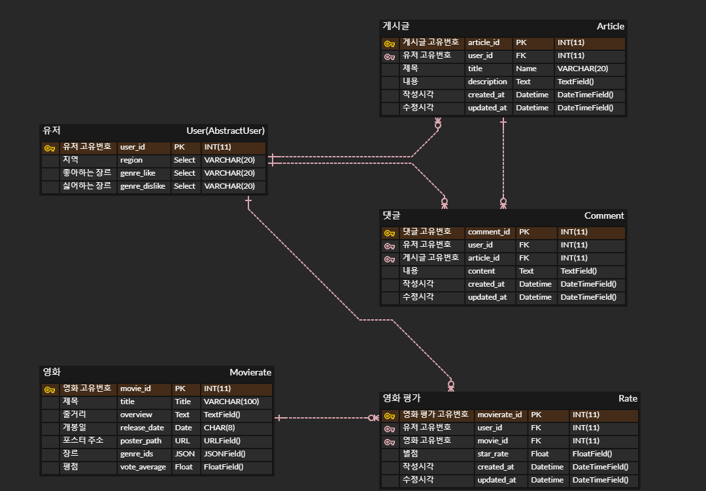
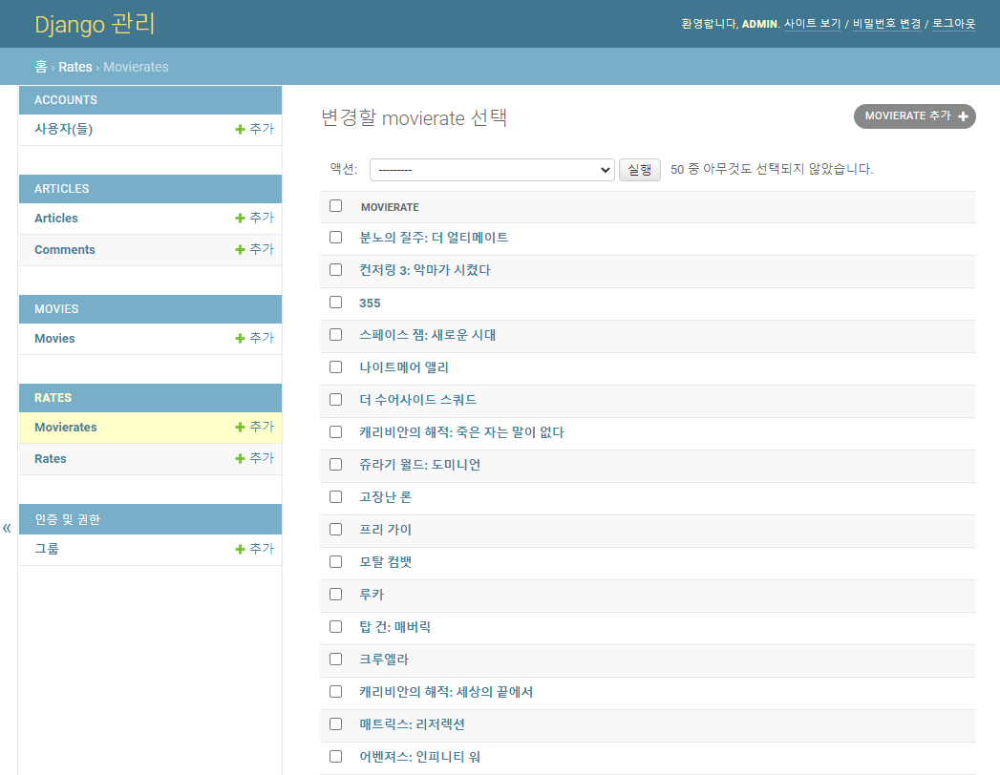
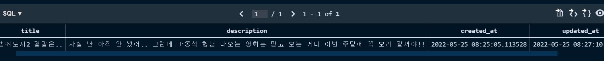
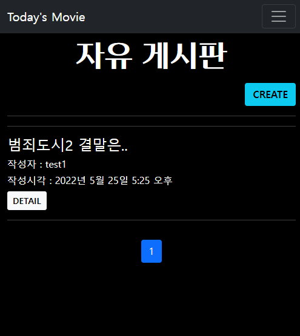

# final-pjt

> 목표
>
> - 영화 데이터 기반 추천 서비스 구성
> - 영화 추천 알고리즘 구성
> - 커뮤니티 서비스 구성
> - HTML, CSS, JavaScript, Vue.js, Django, REST API, Database 등을 활용한 실제 서비스 설계
> - 서비스 관리 및 유지보수

----

## 0. 프로젝트 시작하기

1. 가상환경 생성 & 가상환경 켜기

   `python -m venv venv`, `source venv/Scripts/activate`

2. 가상환경에 requirements.txt 설치

   `pip install -r requirements.txt`

3. DB생성과 마이그레이션 해주기

   `python manage.py makemigrations`, `python manage.py migrate`

4. 갖고 온 영화 데이터 DB에 넣어주기

   `python manage.py loaddata rates/movie_list.json`

5. 서버 켜주기

   `python manage.py runserver`

> 만약 어드민 계정을 만들어 어드민으로 서버에 접속하려면 계정을 만들고 우선 url을 통해 프로필 페이지를 먼저 가서 장르 지정과 위치 지역을 업데이트해야 함. 이 서비스는 위치와 좋아하는 장르 등을 기반으로 추천해 주는 서비스이므로.

----

## 1. 업무 분담

- 강승리 - movies, accounts CRUD 작업, 페이지 CSS 구현, 로그인 form 개선, 모델 조작, 전체적인 테마 기획
- 임수환 - articles, rates CRUD 작업, API 데이터 가져오기, 영화 데이터 JSON 파일로 저장, 모델 조작

----

## 2. 목표 서비스 구현 및 실제 구현 정도

- 목표 서비스 : 해당 지역의 실시간 날씨에 기반한 영화 추천 홈페이지

  > 구현
  >
  > 1. 사용자가 지정한 위치를 저장하여 해당 날씨를 호출.
  > 2. 현재 날씨에 기반한 영화 추천.
  >    - 사용자의 비선호 장르를 제외하며 해당 날씨에 적합한 장르를 바탕으로 영화 추천.
  > 3. 사용자의 선택에 따라 날씨를 제외한 영화 추천.
  >    - 사용자의 선호하는 장르와 비선호하는 장르를 바탕으로 영화 추천.
  > 4. 자유 게시판을 바탕으로 유저들의 소통 공간 창출.
  > 5. 영화 랭킹 페이지를 통해 관리자가 제공하는 영화들을 유저가 평가 가능.

- 실제 구현 정도

  1. 회원가입할 때 지역, 선호하는 장르와 비선호하는 장르를 입력 받도록 진행.

     

  2. 현재 날씨에 기반한 영화 추천.

     - API 로 날씨 정보를 받음.
     - 사전에 제작한 날씨별 장르 목록 데이터로 추천 알고리즘을 구현.

     

  3. 자유 게시판

     - 사용자가 게시글을 작성, 수정, 삭제가 가능함.
     - 다른 사용자가 모든 게시글에 댓글을 작성, 삭제 가능함.

     

  4. 랭킹 페이지

     - admin사이트를 통해 관리자가 제공하는 영화 정보를 나열.
     - 나열 된 영화들을 바탕으로 유저들이 평가 진행.

     

     

----

## 3. 데이터베이스 모델링 (ERD)



----

## 4. 필수 기능에 대한 설명

- A. 관리자 뷰

  1. 관리자 권한의 유저만 영화 등록 / 수정 / 삭제 권한을 가집니다.

     

- B. 영화 정보

  1. 영화 데이터는 Database Seeding을 활용하여 최소 50개 이상의 데이터가 존재하도록 구성.

     TMDB에서 popular 영화 50개를 불러왔음.

     movies/views.py

     ```python
     # 누적 인기 영화 API
     def movie_popular(page):
         # URL 및 요청변수 설정
         BASE_URL = 'https://api.themoviedb.org/3'
         path = '/movie/popular'
         ...
         
         # 결과를 받아서 json형식의 data변수로 저장
         response = requests.get(BASE_URL+path, params=params)
         data = response.json()
         ...
     ```

  2. 로그인 된 유저는 영화에 대한 평점 등록 / 수정 / 삭제 등을 할 수 있어야 함.

     영화에 대한 평점을 진행하며 만약 이미 평점을 진행했으면 기존의 평점은 사라지며 새롭게 평점이 등록하도록 진행했습니다.

     rates/views.py

     ```python
     @require_POST
     def rate_create(request, movie_pk):
         if request.user.is_authenticated:
             movierate = get_object_or_404(Movierate, pk = movie_pk)
             rating = movierate.rates.filter(user=request.user).first()
             rate_form = RateForm(request.POST)
     
             if not rating:
                 if rate_form.is_valid():
                     rate = rate_form.save(commit=False)
                     rate.movierate = movierate
                     rate.user = request.user
                     rate.save()
                 return redirect('rates:detail', movie_pk)
             
             else:
                 # 기존 한줄평 삭제
                 if request.user == rating.user:
                     rating.delete()
                 # 새로운 한줄평 등록
                     rate = rate_form.save(commit=False)
                     rate.movierate = movierate
                     rate.user = request.user
                     rate.save()
                 return redirect('rates:detail', movie_pk)
     
         return redirect('accounts:login')
     ```

- C. 영화 추천 알고리즘

  1. 날씨별로 장르 지정.

     각 숫자들은 TMDB에서 해당 장르의 숫자임.

     ```python
     @login_required
     @require_http_methods(['GET', 'POST'])
     def result_on(request):
         # 싫어하는 장르는 not in으로 필터 & 날씨는 우리의 리스트를 만들어서 해당 장르의 영화 추천
         person = request.user
         # 한글로 받은 지역을 영어로 변환시키기!
         dict_region = {'서울': 'Seoul', '대전': 'Daejeon', '대구': 'Daegu', '부산': 'Busan', '구미': 'Gumi',}
         weather_now = weather(dict_region[person.region])
         
         genre_list = []
         if weather_now[1] == 'Clear':
             genre_list = [14, 36, 10770, 16, 10751, 35, 10749]
         elif weather_now[1] == 'Clouds':
             genre_list = [36, 12, 18, 878, 10752]
         elif weather_now[1] == 'Drizzle':
             genre_list = [9648, 37, 35]
         elif weather_now[1] == 'Rain':
             genre_list = [99, 10402, 53, 80]
         elif weather_now[1] == 'Thunderstorm':
             genre_list = [14, 53, 10752, 27]
         elif weather_now[1] == 'Snow':
             genre_list = [10770, 12, 10749]
         else:
             genre_list = [99, 10752, 28]
         ...
         
     ```

  2. 알고리즘.

     좋아하는 장르 혹은 해당 날씨에 적용된 장르를 추천해주거나 싫어하는 장르는 제외시켜주는 알고리즘.

     ```python
     ...
     suggest_list = []
     for i in range(len(movie_list)):
         if (genre_code_dislike not in movie_list[i][4]) and (genre_code_like in movie_list[i][4]):
             suggest_list.append(movie_list[i])
             ...
     ```

  3. 실시간 api 호출.

     인기있는 영화 100개를 TMDB에서 호출.

     ```python
     # 누적 인기 영화 API
     def movie_popular(page):
         # URL 및 요청변수 설정
         BASE_URL = 'https://api.themoviedb.org/3'
         ...
     
     ...
         movie_list = []
         for i in range(1,6):
             movie_list.extend(movie_popular(i))
             ...
     ```

  > 저희는 처음 회원가입 혹은 회원수정 페이지에서 유저의 좋아하는 장르와 싫어하는 장르 정보를 수집하였으며 추가로 해당 위치 지역 정보를 수집하여 그 데이터를 바탕으로 영화를 추천하도록 진행했습니다.
  >
  > 날씨 기반을 적용하면 날씨에 연결된 해당장르들과 싫어하는 장르를 제외시켜주는 알고리즘으로 영화를 추천하도록 진행했으며 날씨 기반을 해제하면 좋아하는 장르와 싫어하는 장르를 제외시켜주는 알고리즘으로 영화를 추천하도록 진행했습니다.

- D. 커뮤니티

  1. 영화 정보와 관련된 소통을 할 수 있는 커뮤니티 기능을 구현.

     게시글 및 댓글은 생성 및 수정 시각 정보가 포함되어야 함.

     

     

----

## 5. 느낀 점

강승리

> 1. 구체적인 설계
>
>    프로젝트를 진행하며 평소보다 더 많은 시간을 우리 팀은 명세서 읽는 곳에 집중했었습니다. 이 부분은 이후 계속해서 프로젝트를 진행하며 수월하게 진행할 수 있는 기반이 되었다고 생각합니다. 또한 어떤 서비스를 진행할지에 대한 주제 선정을 명확하게 지정해 줌으로써 다음 작업 진행 계획들을 세우는데 편했습니다. 물론 처음 설계대로 끝까지 설계대로만 진행이 되었던 건 아닙니다. 분명 자세히 읽어 봤다고 생각했던 내용들도 작업을 하며 계속해서 추가로 필요한 부분들이 있었습니다. 예를 들어 댓글을 구현하는 부분에 있어 유저가 자신의 댓글을 작성하고 지우고 하는 작업만 되면 된다고 생각하며 진행을 했지만 이후 저희는 중간 점검으로 명세서를 다시 한번 읽어 봤었고 그곳에 생성 및 수정 시각 정보가 포함돼야 한다는 내용이 있었습니다. 이러한 부분들이 있어서 모델을 변경해 주는 등 설계가 조금은 바뀌는 부분이 있었습니다. 하지만 처음 설계에서 기반을 단단하게 세워놓은 덕분에 흔들림 없이 프로젝트를 이어나갈 수 있었습니다.
>
>    > 즉, 프로젝트 시작 단계에서 소통을 많이 하며 방향성을 명확하게 지정하는 것이 프로젝트에서 얼마나 도움 되는지를 이번 프로젝트를 진행하며 느꼈습니다.
>
> 2. 팀플
>
>    좋은 팀원을 만났다고 생각했습니다. 아무리 같이 계속해서 소통하고 작업하는 과정을 가지며 전체적인 프로젝트 맥락과 서비스 방향은 같을 수 있어도 사소한 부분에 있어 조금 다르게 생각하는 부분들이 있었습니다. 예를 들어 UI에 있어서 어떻게 진행하는 것이 유저에게 더 편리한 구성으로 진행이 될 것인지부터 해서 버튼의 위치 등 생각의 차이가 있었던 부분이 있었을 때, 제가 느꼈던 좋은 팀원을 만났다고 생각한 이유는 각자의 생각을 갖고 각자의 생각을 서로 상대방에게 설득하기 위해 논리적으로 이야기를 풀어나가며 진행할 수 있는 소통이 되었기 때문입니다.  상대방의 의견에 '그냥 그렇게 해~' 라던가 '무조건 내 의견대로 진행하자!' 가 아닌 '내 생각엔 뒤로가기 버튼은 생성하기 버튼과 같은 위치에 있으면 혼란을 줄 수 있으므로 다른 위치로 옮기는 것이 좋은 거 같은데 어떻게 생각하세요?' 등으로 진행했던 부분이 있었습니다.
>
>    > 즉, 제 역할인 팀장으로 원활하게 소통을 진행하고 같은 목표를 갖도록 하며 같이 그 목표를 향해 나아가는 것을 유도하려고 노력을 했으며 그러한 과정에서 팀원의 역할이었던 수환 님께서 능동적으로 정말 잘해주셔서 팀장의 역할이 어렵지 않았습니다.
>
> 3. 구글링
>
>    검색 능력이 엄청 늘었습니다. 문서를 보는 것에 대한 두려움이 없어졌고 오히려 문서를 보는 게 편해졌습니다. 분명 수업 때 계속해서 공식 문서를 강조해 주셨고 따라서 공식 문서 참조를 하려고 했었지만 그때까지만 해도 여전히 공식 문서에 대한 불편함이 있었는데 이번 프로젝트를 진행하며 계속해서 문서를 많이 찾다 보니  장황하게 나열된 내용들에 지레 겁먹지 않고 필요한 부분들을 쏙쏙 골라 먹는 능력이 늘었습니다.
>
>    > 즉, 공식 문서 사용에 대한 불편함이 해소됐습니다.

임수환

>   프로젝트 조원이 정해지고 처음 명세서를 받았을 때 들었던 생각은 딱 두 가지였던 거 같습니다. 학기 초에 git 실습을 함께한 적이 있는 승리님과 같은 조가 되어 다행이라는 점과, 그럼에도 명세서의 필수사항들을 과연 우리가 모두 시간 내에 구현할 수 있을까에 대한 의문이었습니다. 다행히도 그동안 관통 프로젝트를 진행하면서 학습한 내용들과, 조원과의 의논 및 검색을 통해 찾은 해답들을 통해 저희는 프로젝트를 나름 수월히 진행할 수 있었습니다.
>
>   대부분의 프로젝트는 디스코드의 화면공유를 통해 함께 진행하는 방식으로 했지만, 서로가 조금 더 강점인 부분을 맡아서 프론트엔드와 백엔드로 나누어 프로젝트를 주도했습니다. 승리님 같은 경우에는 html과 CSS 위주로 프론트엔드의 배치 및 디자인적 요소에 뛰어났고, 저는 파이썬을 이용해 API 데이터를 받아서 가공 및 적용하는 것에 조금 더 익숙함을 느낀 덕분에 서로가 부족한 부분을 채워주며 훌륭한 시너지를 낼 수 있었던 것 같았습니다. 혼자였다면 훨씬 오래 걸리고 구현해낼 수 없었을 기능들도, 승리님과 함께한 끝없는 시도와 의논 끝에 결국에는 해답을 찾아낼 수 있었던 것 같습니다. 프로젝트를 진행하며 UI 배치나 색깔 지정 등의 사소한 부분에서 생각이 다른 경우도 간혹 있었지만, 서로가 서로의 의견을 존중하고 때론 양보하며 타협한 덕분에 좋은 분위기에서 프로젝트를 마무리할 수 있었던 것 같고, 이에 감사한 마음이 들었습니다.
>
>   프로젝트를 마무리하며 우리가 구현한 웹페이지들을 보니 하나의 웹 사이트가 완성된 것 같아서 정말 뿌듯했고, 지난 1학기 동안 많은 것들을 배우며 코딩 능력을 길렀다는 것을 깨닫게 되었습니다. 이번 프로젝트는 웹페이지 구현에 조금 더 자신감을 가질 수 있는 계기가 되었던 것 같고, 앞으로 실력을 꾸준히 더 늘려서 실시간 API를 통한 유용한 웹페이지 제작을 해보고 싶다는 생각도 가지게 되었습니다.
